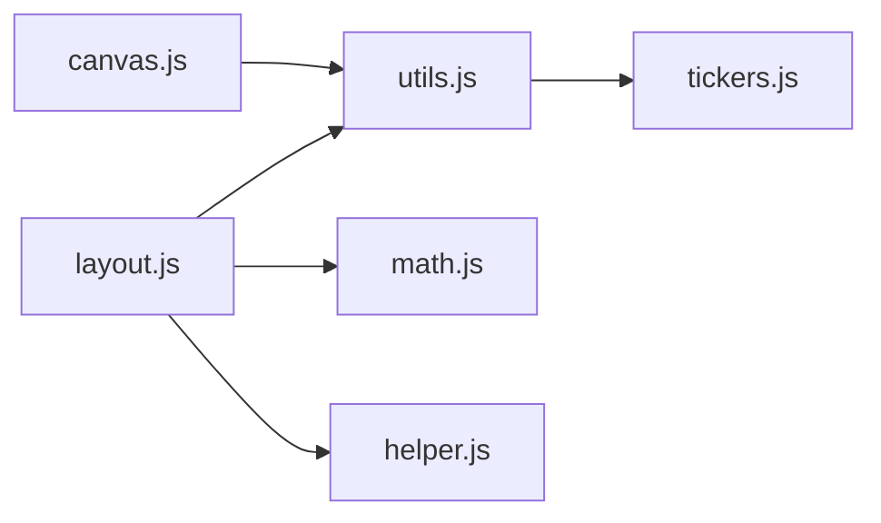
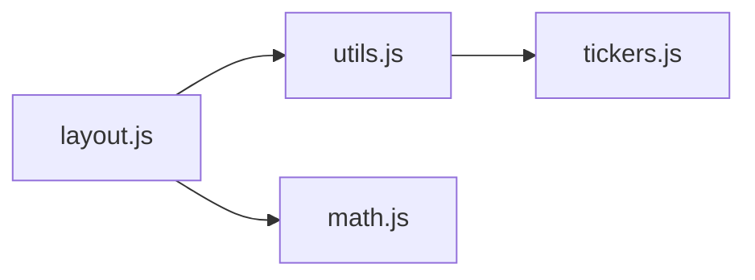
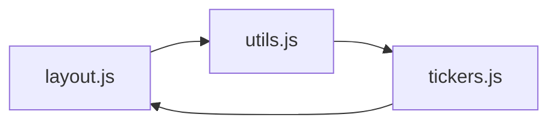
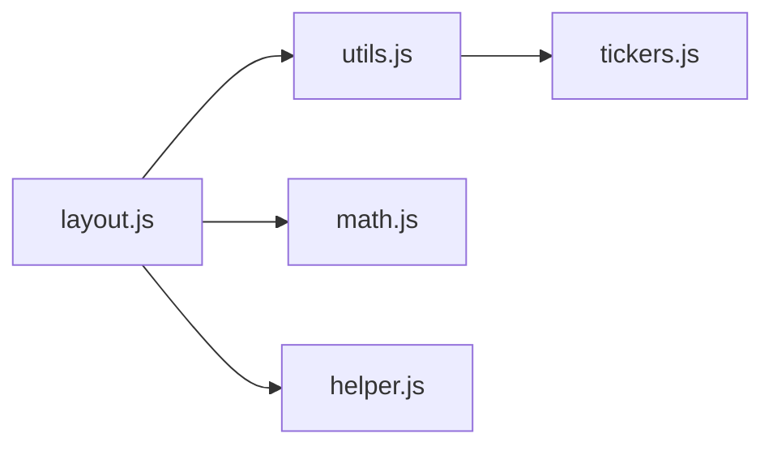

:: title ::

# Item 61

<ChiikawaItem2e text="Item 82 (2e)" />

:: content ::

# Item 61: Convert Module by Module Up Your Dependency Graph

<p>The very first modules to migrate are your third-party dependencies since, by definition, you import them but they don’t import you.</p>

<v-click>
<p>And migrate your own modules from the bottom of the dependency graph upwards.</p>
</v-click>

---
transition: fade-out
layout: side-title
side: l
color: pink-light
titlewidth: is-4
align: rm-lm

---
:: title ::

# Item 61

<ChiikawaItem2e text="Item 82 (2e)" />

:: content ::

# Item 61: Convert Module by Module Up Your Dependency Graph

If you’d like to take any guesswork out of the ordering, you can run a **topological sort** on your dependency graph.


---
transition: fade-out
layout: side-title
side: l
color: pink-light
titlewidth: is-4
align: rm-lm

---
:: title ::

# Item 61

<ChiikawaItem2e text="Item 82 (2e)" />

:: content ::

<h1> Topological Sorting </h1>

- What’s Topological Sorting?
- Graph
- Graph Traversal
- Topological Sorting Algorithm
- Topological Sorting Problems

---
transition: fade-out
layout: side-title
side: l
color: pink-light
titlewidth: is-4
align: rm-lm

---
:: title ::

# Item 61

<ChiikawaItem2e text="Item 82 (2e)" />

:: content ::

<h1> What’s Topological Sorting </h1>

A topological sort is a graph traversal in which each vertex is visited only after all its dependencies are visited.

<v-click>

</v-click>

<v-click>
<h2> Sorting Result </h2>
['tickers.js', 'utils.js', 'math.js', 'helper.js', 'layout.js', 'canvas.js'] 
</v-click>

---
transition: fade-out
layout: side-title
side: l
color: pink-light
titlewidth: is-4
align: rm-lm

---
:: title ::

# Item 61

<ChiikawaItem2e text="Item 82 (2e)" />

:: content ::

<TopologicalSortingResult />

---
transition: fade-out
layout: side-title
side: l
color: pink-light
titlewidth: is-4
align: rm-lm

---
:: title ::

# Item 61

<ChiikawaItem2e text="Item 82 (2e)" />

:: content ::

<h1> Graph </h1>

A graph data structure is a way to represent relationships between objects.

<ul>
<v-click>
<li> Vertices (Nodes): These represent the objects or entities in the graph. </li>
</v-click>
<v-click>
<li> Edges: These represent the connections or relationships between the vertices. </li>
</v-click>
</ul>

<v-click>

</v-click>

---
transition: fade-out
layout: side-title
side: l
color: pink-light
titlewidth: is-4
align: rm-lm

---
:: title ::

# Item 61

<ChiikawaItem2e text="Item 82 (2e)" />

:: content ::

<h1> Cycle </h1>

A path that starts and ends at the same vertex.

<v-click>

</v-click>

<v-click>
<h2> Question: Can we topological sort for a cycle graph? </h2>
</v-click>
<v-click>
<br />
A topological ordering is possible if and only if the graph has no directed cycles.
</v-click>

---
transition: fade-out
layout: side-title
side: l
color: pink-light
titlewidth: is-4
align: rm-lm

---
:: title ::


:: content ::

<h1> Adjacent List </h1>

A list where each element corresponds to a vertex, and the list contains the vertices adjacent to it.

```ts {1-7|9-11|12-13|12-19}
const edges = [
    ['layout.js', 'utils.js'],
    ['layout.js', 'math.js'],
    ['layout.js', 'helper.js'],
    ['canvas.js', 'utils.js'],
    ['utils.js', 'tickers.js']
];

interface AdjacentList {
    [key: string]: string[];
}
const graph: AdjacentList = {
    ['layout.js']: ['utils.js', 'math.js', 'helper.js'],
    ['canvas.js']: ['utils.js'],
    ['utils.js']: ['tickers.js'],
    ['tickers.js']: [],
    ['math.js']: [],
    ['helper.js']: [],
};
```

---
transition: fade-out
layout: side-title
side: l
color: pink-light
titlewidth: is-4
align: rm-lm

---
:: title ::

# Item 61

<ChiikawaItem2e text="Item 82 (2e)" />

:: content ::

<h1> Graph Traversal </h1>
<br />

<v-click>
<h2> DFS (Depth-First Search) </h2>
DFS starts at the root node and explores as far as possible along each branch before backtracking.
</v-click>

<p />
<v-click>
<h2> BFS (Breadth-First Search) </h2>
BFS starts at the tree root and explores all nodes at the present depth prior to moving on to the nodes at the next depth level.
</v-click>

---
transition: fade-out
layout: side-title
side: l
color: pink-light
titlewidth: is-4
align: rm-lm

---
:: title ::

# Item 61

<ChiikawaItem2e text="Item 82 (2e)" />

:: content ::

<h1> DFS (Depth-First Search) </h1>
<br />
<v-click>

</v-click>

<v-click>
<h2> Question: What’s order of visited files? </h2>
</v-click>
<v-click>
DFS Result: ['layout.js', 'utils.js', 'tickers.js', 'math.js', 'helper.js']
</v-click>

---
transition: fade-out
layout: side-title
side: l
color: pink-light
titlewidth: is-4
align: rm-lm

---
:: title ::

# Item 61

<ChiikawaItem2e text="Item 82 (2e)" />

:: content ::

<DFS />

---
transition: fade-out
layout: side-title
side: l
color: pink-light
titlewidth: is-4
align: rm-lm

---
:: title ::


:: content ::

<h1> DFS (Depth-First Search) </h1>

```ts {1-8|10-20}
interface AdjacentList { [key: string]: string[]; }
const graph: AdjacentList = {
    ['layout.js']: ['utils.js', 'math.js', 'helper.js'],
    ['utils.js']: ['tickers.js'],
    ['tickers.js']: [],
    ['math.js']: [],
    ['helper.js']: [],
};

const visited = new Set();
const dfs = (node: string) => {
    if (visited.has(node)) return;

    visited.add(node);
    for (const child of graph[node]) {
        dfs(child);
    }
    console.log(node);
}
dfs('layout.js');
```

---
transition: fade-out
layout: side-title
side: l
color: pink-light
titlewidth: is-4
align: rm-lm

---
:: title ::

# Item 61

<ChiikawaItem2e text="Item 82 (2e)" />

:: content ::

<h1> Topological Sorting Algorithm </h1>

```{1,17-18|3-5|3,6-7|3,9|3,11-12|3,14-15|all}
L ← Empty list that will contain the sorted nodes

function visit(node n)
    if n has a permanent mark then
        return
    if n has a temporary mark then
        stop   (graph has at least one cycle)

    mark n with a temporary mark

    for each node m with an edge from n to m do
        visit(m)

    mark n with a permanent mark
    add n to head of L

while exists nodes without a permanent mark do
    visit(n)
```

<v-click>
<h2> Question: Topological sorting time and space complexity?</h2>
</v-click>
<v-click>
Time Complexity: O(V + E), Space Complexity: O(V)
</v-click>

---
transition: fade-out
layout: side-title
side: l
color: pink-light
titlewidth: is-4
align: rm-lm

---
:: title ::

# Item 61

<ChiikawaItem2e text="Item 82 (2e)" />

:: content ::

<h1> TypeScript Implementation </h1>

```ts {1-5|22-23|7-8,20|7,9-12,20|7,14,20|7,16,20|7,18-19,20|all}
declare graph: { [key: string]: string[]; };
// {['layout.js']: ['utils.js', 'math.js', 'helper.js'], ...}
const permanent = new Set();
const temporary = new Set();
const result: string[] = [];

const visit = (node: string) => {
    if (permanent.has(node)) return;
    if (temporary.has(node)) {
        console.log('Find cycle');
        return;
    }

    temporary.add(node);

    for (const child of graph[node]) visit(child);

    permanent.add(node);
    result.push(node);
}

for (const vertex of Object.keys(graph)) visit(vertex);
console.log(result);
```

---
transition: fade-out
layout: side-title
side: l
color: pink-light
titlewidth: is-4
align: rm-lm

---
:: title ::

# Item 61

<ChiikawaItem2e text="Item 82 (2e)" />

:: content ::

<TopologicalSorting />

---
transition: fade-out
layout: side-title
side: l
color: pink-light
titlewidth: is-4
align: rm-lm

---
:: title ::

# Item 61

<ChiikawaItem2e text="Item 82 (2e)" />

:: content ::

# Topological Sorting Problems

<ul>
    <li>
        <a href="https://leetcode.com/problems/course-schedule-ii/">
            210. Course Schedule II (Medium)
        </a>
    </li>
    <li>
        <a href="https://leetcode.com/problems/find-eventual-safe-states/">
            802. Find Eventual Safe States (Medium)
        </a>
    </li>
    <li>
        <a href="https://leetcode.com/problems/sort-items-by-groups-respecting-dependencies/">
            1203. Sort Items by Groups Respecting Dependencies (Hard)
        </a>
    </li>
</ul>