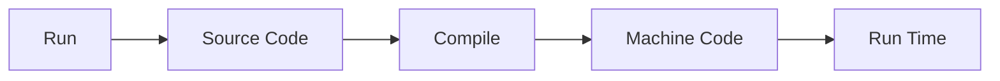
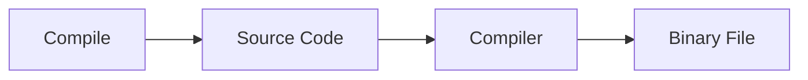
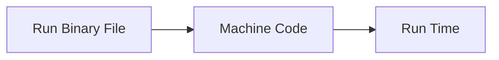

<div class="text-center">
  <h1>A 10x Faster TypeScript</h1>
  Port TypeScript by Go
  <div class="flex items-center justify-center mt-8">
    
  </div>
</div>

---
transition: fade-out
layout: side-title
side: l
color: pink-light
titlewidth: is-4
align: rm-lm

---
:: title ::

# A 10x Faster TypeScript

:: content ::

<Youtube id="pNlq-EVld70" width="550px" height="300px"/>

---
transition: fade-out
layout: side-title
side: l
color: pink-light
titlewidth: is-4
align: rm-lm

---
:: title ::

# A 10x Faster TypeScript

:: content ::

<style>
strong {
  -webkit-text-fill-color: rgba(0, 0, 0, 0);
  background-image: linear-gradient(108deg, #0894FF, #C959DD 34%, #FF2E54 68%, #FF9004);
  -webkit-background-clip: text;
}
</style>

- Faster compile time
- Reduce memory usage
- Improve TypeScript Language Server Protocol (LSP)
- <strong>AI</strong> tools to enhance development

---
transition: fade-out
layout: side-title
side: l
color: pink-light
titlewidth: is-4
align: rm-lm

---
:: title ::

# A 10x Faster TypeScript

:: content ::

# How Much Faster?

|**Project**|**Lines of Code**|**Current(JS)**|**Native(Go)**|**Speedup**|
|--------|--------|--------|--------|--------|
|VS Code|1,505,000|77.8s|7.5s|10.4x|
|Playwright|356,000|11.1s|1.1s|10.1x|
|TypeORM|	270,000|17.5s|1.3s|13.5x|

---
transition: fade-out
layout: side-title
side: l
color: pink-light
titlewidth: is-4
align: rm-lm

---
:: title ::

# A 10x Faster TypeScript

:: content ::

# Why Go?

- <a href="https://github.com/microsoft/typescript-go/discussions/411" target="_blank">Discussion</a>
- Low level
- Easy to port
- Built-in concurrency
<div style="padding: 0 24px 16px;">
```go
go f(x, y, z)
```
</div>

---
transition: fade-out
layout: side-title
side: l
color: pink-light
titlewidth: is-4
align: rm-lm

---
:: title ::

# A 10x Faster TypeScript

:: content ::

# Easy to port

- Hyrum's Law
- Port, not rewrite
- Only plain object and function in TypeScript codebase
  - (No OOP and Inheritance)

<v-click>
<br/>
<b>Which language is TypeScript written in?</b>
</v-click>
<v-click>
<p>Answer: TypeScript is written in TypeScript now (<a href="https://en.wikipedia.org/wiki/Self-hosting_(compilers)" target="_blank">Self-hosting</a>)</p>
</v-click>

---
transition: fade-out
layout: side-title
side: l
color: pink-light
titlewidth: is-4
align: rm-lm

---
:: title ::

# A 10x Faster TypeScript

:: content ::

# Try typescript-go

<a href="https://go.dev/doc/install" target="_blank">Install Go</a>
- Build typescript-go
```shell
git clone https://github.com/microsoft/typescript-go/;
cd typescript-go;
npm install -D hereby;
hereby build;
```

- Run typescript-go
```shell
cd ~/your-project;
~/your-typescript-go/built/local/tsgo -noEmit;
``` 

---
transition: fade-out
layout: top-title
color: pink-light
align: l
---

:: title ::

# JIT & AOT

:: content ::

<h1>JavaScript, JIT (Just-In-Time)</h1>
<v-click>

</v-click>
<br />
<h1>Go, AOT (Ahead-Of-Time)</h1>
<v-click>

</v-click>
<v-click>

</v-click>

---
transition: fade-out
layout: side-title
side: l
color: pink-light
titlewidth: is-4
align: rm-lm

---
:: title ::

# A 10x Faster TypeScript

:: content ::

# Developer Roadmap

- TypeScript 6 (TS) will introduce some deprecations and breaking changes
- TypeScript 7.0 (Go)